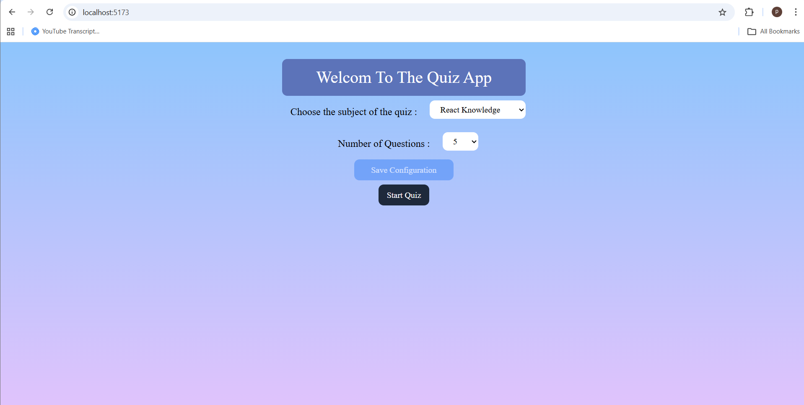

# Quiz App (React + JSON Server)

A simple quiz application built with **React**, **TailwindCSS**, and **useReducer**. It fetches data from a local **JSON Server**.  
You need to have the JSON Server running alongside the React App for the project to function correctly.

---

## 🚀 Features

- Fetch and display quizzes from JSON Server
- Allows users to select answers and view their final score
- Responsive design implemented with TailwindCSS
- Managed with **useReducer** hook
- Clean, component-based code structure

---

## prerequisites

Before you begin, ensure you have the following installed:

- [Node.js](https://nodejs.org) >= 14
- [npm](https://www.npmjs.com) or [yarn](https://yarnpkg.com)

---

## Demo



## ⚙️ Installation and Running

1. Clone the repository:

```bash
   git clone https://github.com/pooriaamini/Quiz-App.git
   cd Quiz-App
```

2. Install dependencies:

```bash
   npm install
```
3. Start the JSON Server and the React App:(Assumes data is stored in db.json):

```bash
   # Start JSON Server
   npm run server

   # Start React App
   npm run dev
```
